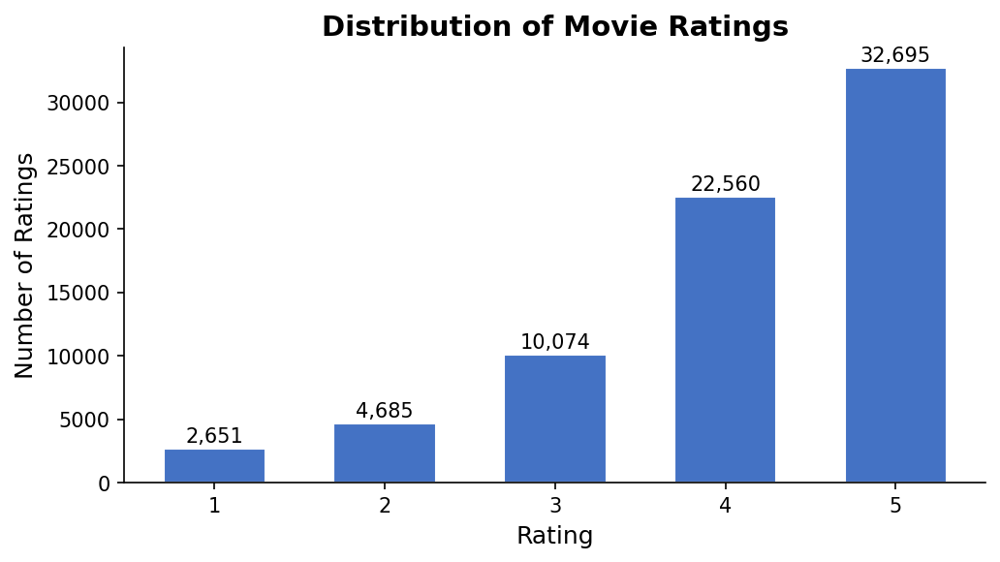
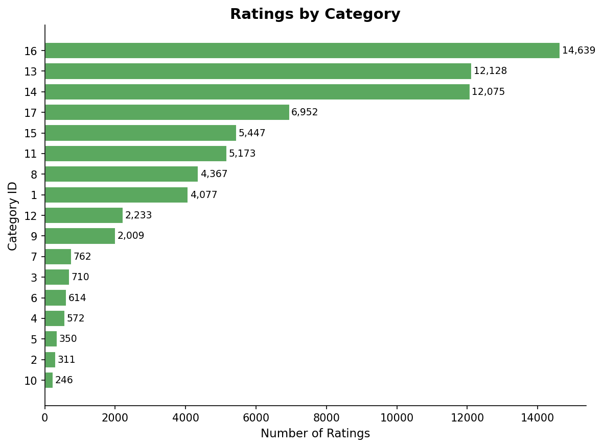
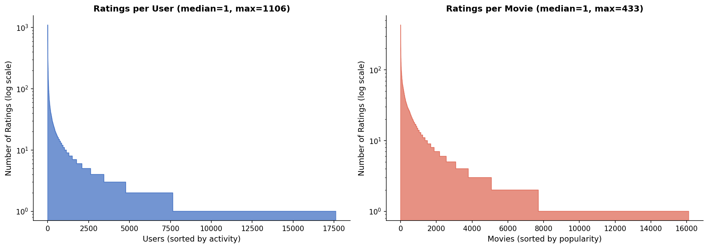
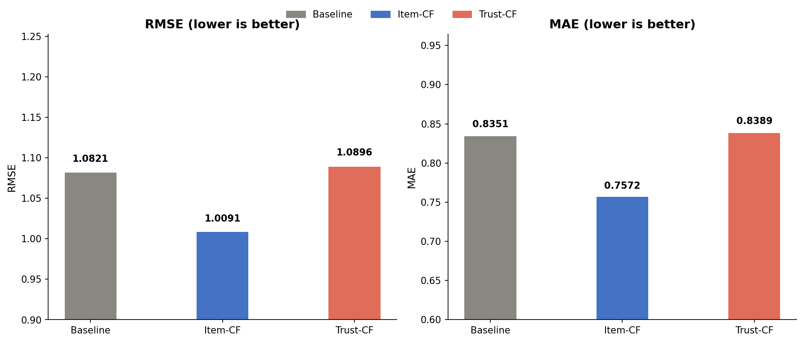
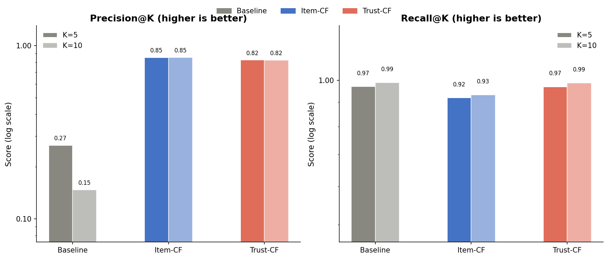
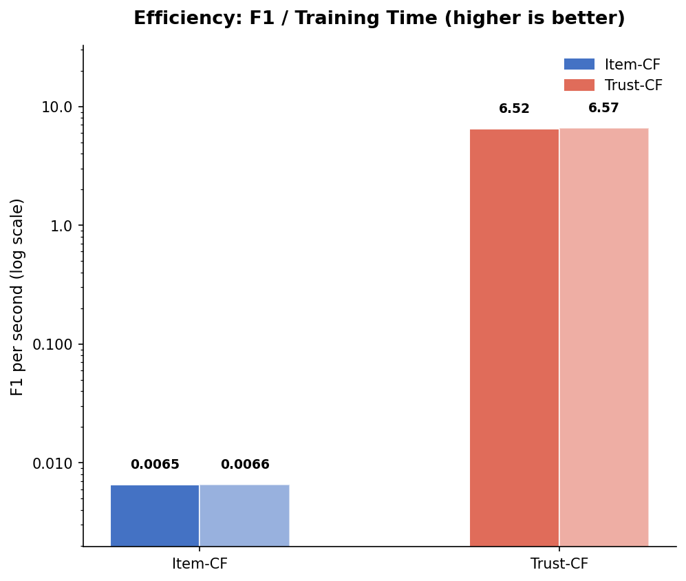

[README.md](https://github.com/user-attachments/files/27288414/README.md)
# Movie Recommendation System
**CSIT 360 — Advanced Techniques in Data Science**
Spring 2026 | Montclair State University

---

## Team Members
| Name | GitHub |
|------|--------|
| Viet Hai Nguyen | @vhai2801 |

---

## Project Overview
This project builds a movie recommendation system using the CiaoDVD dataset — a real-world dataset of 72,665 movie ratings crawled from dvd.ciao.co.uk in December 2013. We implement and compare two models: a Global Average baseline and an Item-Based Collaborative Filtering model using K-Nearest Neighbors.

---

## Dataset
**CiaoDVD** — download from: https://guoguibing.github.io/librec/datasets.html

Place the downloaded files in `data/raw/`:
```
data/
└── raw/
    ├── movie-ratings.txt   ← 72,665 ratings (main file)
    └── trusts.txt          ← 40,133 trust links (optional)
```

| File | Columns | Size |
|------|---------|------|
| movie-ratings.txt | userId, movieId, categoryId, reviewId, rating, reviewDate | 72,665 rows |
| trusts.txt | trustorId, trusteeId, trustRating | 40,133 rows |

---

## Exploratory Data Analysis







---

## Repository Structure
```
recommendation-system/
├── data/
│   ├── raw/    
│   └── processed/           
├── results/
│   ├── figures/             
│   └── performance_metrics.csv        
├── 1_visualization.py
├── 2_global_avg.py
├── 3_item_based.py
├── 4_trust_network.py
├── 5_metrics_visual.py
├── precision_recall.py
├── requirements.txt
├── .gitignore
└── README.md
```

---

## Installation

**Requirements:** Python 3.11 or 3.13

1. Clone the repository:
```bash
git clone https://github.com/vhai2801/recommendation-system.git
cd recommendation-system
```

2. Install dependencies:
```bash
pip install -r requirements.txt
```

> **Note for Python 3.13 users:** `scikit-surprise` has no pre-built wheel for Python 3.13 and must be installed from source:
> ```bash
> pip install git+https://github.com/NicolasHug/Surprise.git
> ```
> If that fails due to a Cython error, clone the repo, patch `np.int_t` → `np.intp_t` in `surprise/prediction_algorithms/co_clustering.pyx`, then run `pip install .`

---

## How to Run

Run the scripts in order from the project root:

```bash
python 1_visualization.py    # Data loading, cleaning, EDA charts
python 2_global_avg.py       # Global Average baseline model
python 3_item_based.py       # Item-Based CF model (takes ~2 mins)
python 4_trust_network.py    # Trust Network model
python 5_metrics_visual.py   # Comparison charts
```

---

## Results Summary

### RMSE & MAE
| Model | RMSE | MAE | Time |
|-------|------|-----|------|
| Global Average (Baseline) | 1.0821 | 0.8351 | 0.0001s |
| Item-Based CF (KNN) | 1.0091 | 0.7572 | 135.47s |
| Trust Network (User-Based) | 1.0896 | 0.8389 | 0.14s |

### Precision & Recall
| Model | Precision@5 | Recall@5 | Precision@10 | Recall@10 |
|-------|-------------|----------|--------------|-----------|
| Global Average (Baseline) | 26.56% | 97.04% | 14.68% | 98.91% |
| Item-Based CF (KNN) | 85.27% | 91.93% | 85.16% | 93.19% |
| Trust Network (User-Based) | 82.42% | 96.90% | 82.33% | 98.69% |

**Key finding:** Item-Based CF achieves the best RMSE and MAE. Trust Network matches Item-Based CF on Precision while nearly matching the Global Average's high Recall — and trains in under a second compared to Item-Based CF's ~2 minutes, making it the most efficient model. The Global Average's high Recall comes at the cost of near-random Precision since it recommends every above-average movie without personalization.
    In conclusion: Trust Network is the best model out of the 3. It is an all rounder that can be applied to even larger dataset due to its high efficiency and performance.

### Charts







---

## Dependencies
```
pandas==3.0.2
numpy==1.26.4
matplotlib==3.10.9
scikit-learn==1.8.0
scikit-surprise==1.1.4
```
